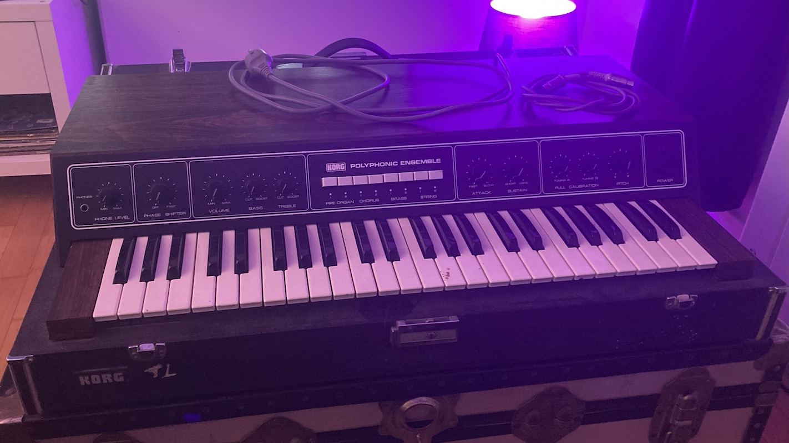
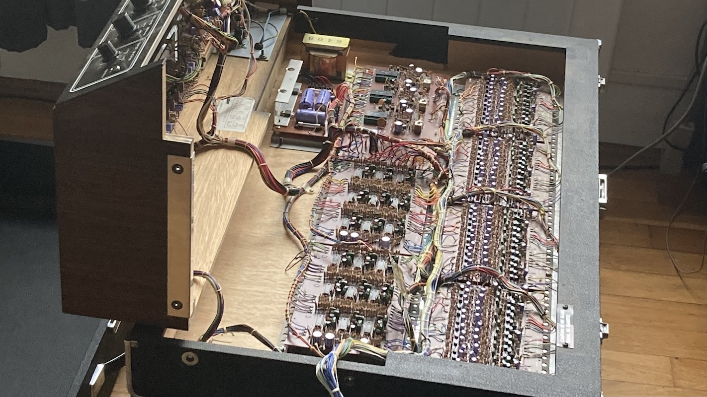
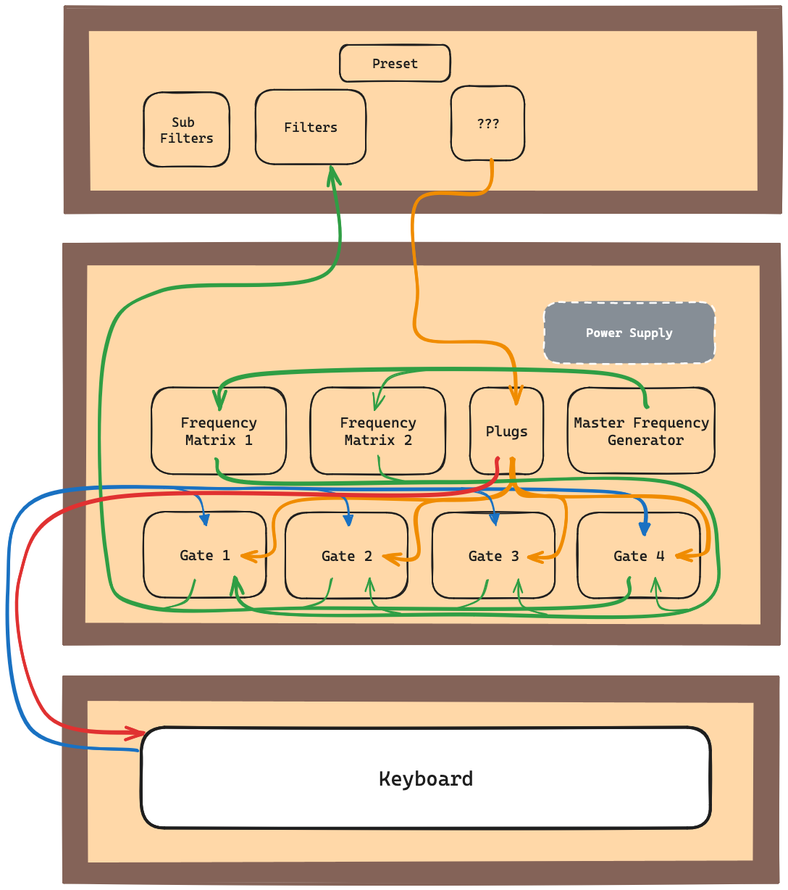
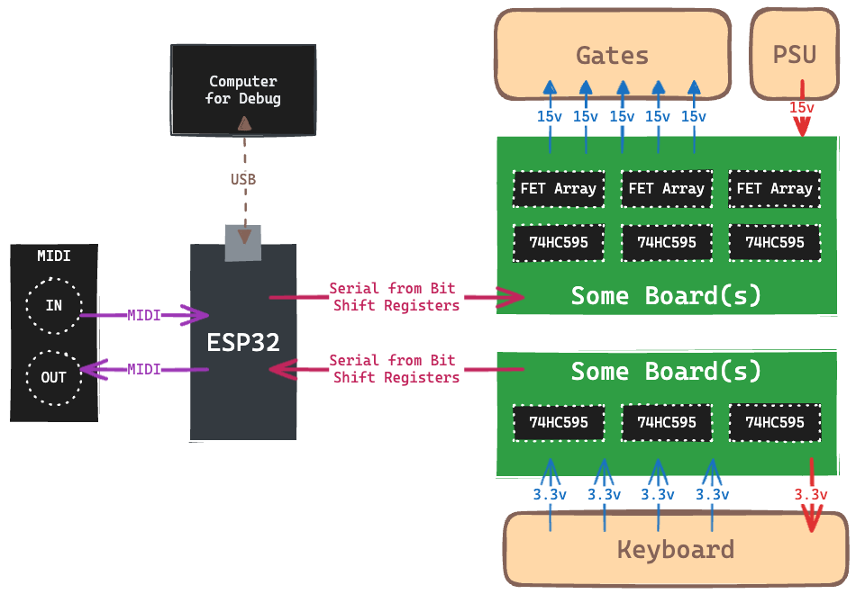

# Korg PE2000 Midification

This repository should contain everything related to my attempt at adding a MIDI Input and Output to an old Korg PE2000 synthetizer.

## The Synth

### Architecture

## The Plan

The plan itself is quite simple : 
1. Listen to Keyboard inputs and send corresponding MIDI OUT notes
2. Listen to MIDI IN and trigger synth accordingly
3. Profit

Now for the interesting part :
- Find a way to receive 48 digital inputs (from the Keyboard)
- Find a way to switch 48 digital outputs at 15v DC (to the Synth)

To handle the numerous IOs, since they are all simple bit flips, I'm going to use a bunch of Bit Shift Registers.

To handle the 15v switching, temporarily, i'm using Relays, but the plan is to use Darlington arrays.

## Roadmap

- [x] Synth internal reverse engineering
- [ ] ~~Arduino Board MIDI Communication~~
- [ ] ESP32 Board MIDI Communication
- [ ] 48 key matrix Input from the Keyboard
- [ ] 48 output 15v switches to the Envelope Generators
- [ ] Proper Matrix board with connectors

# Resources

- [Service Manual / Schematics](./docs/schematics.pdf)
- [Tubbutec - Organ Donor](https://tubbutec.de/blog/midi-for-korg-pe-1000-organdonor/)